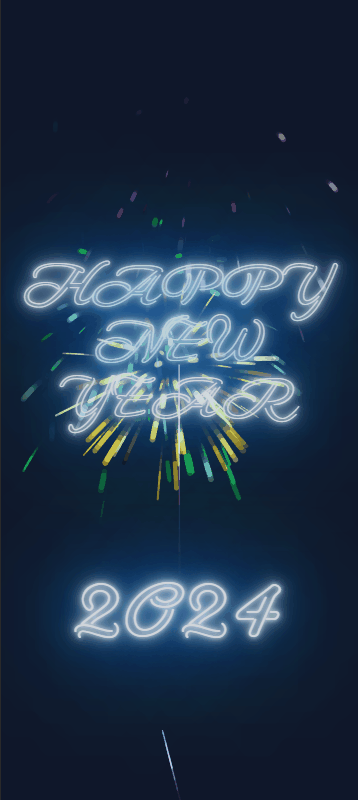

### <div align="center">Escolha seu idioma | Choose your language </div>

<div align="center">

[](https://github.com/edilan-ribeiro/new-year-2024/blob/main/README.md) 
[](https://github.com/edilan-ribeiro/new-year-2024/blob/main/README.en.md)<br>


</div>
<br>
<a name="readme-top"></a>

<br />
<div align="center">
  <a href="https://github.com/edilan-ribeiro/new-year-2024">
    
  </a>

<h3 align="center">Feliz Ano Novo!</h3>

  <p align="center">
    Uma página simples para comemorar a chegada de 2024
  </p>
  
  <a href="https://new-year-2024-theta.vercel.app/">Ver online</a>
</div>

<br>

<details>
  <summary>Índice</summary>
  <ol>
    <li>
      <a href="#sobre-o-projeto">Sobre o projeto</a>
      <ul>
        <li><a href="#feito-com">Feito com</a></li>
        </ul>
    </li>
    <li><a href="#utilização">Utilização</a></li>
    <li><a href="#contato">Contato</a></li>
  </ol>
</details>

<br><br>
## Sobre o projeto

 


<br>Uma página simples para comemorar a chegada de 2024.

Que seu ano seja próspero e cheio de alegria, um feliz ano novo! 




<p align="right">(<a href="#readme-top">back to top</a>)</p>


### Feito com

<div align="center">


</div>

<p align="right">(<a href="#readme-top">back to top</a>)</p>

## Utilização

Após clonar, baixar ou fazer um fork, utilize o comando abaixo para instalar as dependências do projeto:

```shell
npm install
```

Esse projeto te permite:
- Assistir queima de fogos e ver um lindo neon!
- Clicando na tela os fogos podem ir até seu mouse para explodirem

<p align="right">(<a href="#readme-top">back to top</a>)</p>

## Contato

💌 Para me mandar uma mensagem basta usar um dos botões abaixo!<br>

  <a href = "mailto:edilanbusiness@gmail.com" target="_blank"></a>
  <a href="https://www.linkedin.com/in/edilan-ribeiro-santos" target="_blank"></a> 
  <a href="https://whatsa.me/5561983769634/?t=Ol%C3%A1,%20vim%20atrav%C3%A9s%20do%20seu%20GitHub!" target="_blank">
  </a>


<p align="right">(<a href="#readme-top">back to top</a>)</p>
